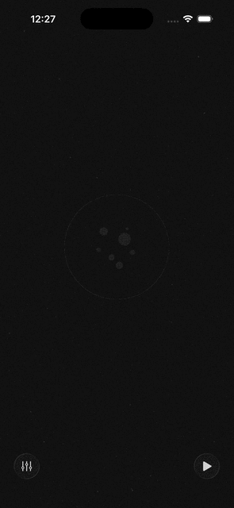

# noisey

A white noise machine that runs on a Raspberry Pi. Drop it in a small enclosure with a speaker, control it from your phone.

Built in Rust. Single binary. No dependencies to install on the Pi.

## What it does

- Generates white, pink, and brown noise procedurally
- Plays `.wav` and `.ogg` sound files you provide (rain, wind, whatever you want)
- **Upload recordings from your phone** — open the web UI, tap `+`, pick a voice memo or audio file. Supports M4A, MP3, WAV, OGG, AAC, and FLAC.
- Uploads are automatically crossfade-looped so a short recording plays all night without an audible cut
- Mixes multiple sounds with independent volume controls
- Sleep timer with presets from 1 minute to 8 hours
- Schedule — set a nightly window (e.g. 22:00–07:00) and it starts and stops automatically
- Web UI designed for your phone — open the Pi's IP in a browser and you're done

<p align="center">
  
</p>

## Hardware

This was built for a **Raspberry Pi Zero W** with a small 3" speaker in a compact enclosure. That's the whole thing — Pi, speaker, power cable.

For audio output, wire up an I2S DAC/amp like the [MAX98357A](https://www.adafruit.com/product/3006) ($6). See the [build guide](docs/BUILD.md) for wiring and setup details.

## Getting started

```bash
cargo build --release
./target/release/noisey
```

Open `http://<pi-ip>:8080` on your phone.

### Uploading sounds

Open the web UI on your phone, tap the sounds button, and hit the `+` pill at the bottom. Pick a voice memo or audio file — it gets uploaded, decoded, crossfade-looped, and is ready to play immediately.

Supported formats: `.m4a`, `.mp3`, `.wav`, `.ogg`, `.aac`, `.flac`

### Custom sounds (manual)

You can also drop audio files directly into the `sounds/` directory:

```bash
./target/release/noisey --sounds-dir ~/my-sounds
```

Filenames become display names — `ocean-waves.ogg` shows up as "Ocean Waves".

## Deploy to the Pi

Cross-compile from your dev machine:

```bash
cargo install cross --git https://github.com/cross-rs/cross
./cross-compile.sh           # aarch64 (Pi Zero 2 W, Pi 3/4/5)
./cross-compile.sh armv7     # armv7 (Pi Zero W, Pi 2/3)
```

Copy to the Pi and run as a service:

```bash
scp target/aarch64-unknown-linux-gnu/release/noisey pi@noisey.local:/usr/local/bin/
scp noisey.service pi@noisey.local:/tmp/

ssh pi@noisey.local
sudo mv /tmp/noisey.service /etc/systemd/system/
sudo systemctl daemon-reload
sudo systemctl enable --now noisey
```

## API

Everything the web UI does goes through a simple REST API:

| Method | Path | Description |
|--------|------|-------------|
| `GET` | `/api/status` | Full device status |
| `GET` | `/api/sounds` | List all sounds with state |
| `POST` | `/api/sounds/:id/toggle` | Toggle a sound on/off |
| `POST` | `/api/sounds/upload` | Upload a sound (multipart form) |
| `DELETE` | `/api/sounds/:id` | Delete a custom sound |
| `POST` | `/api/volume` | Set master volume `{ "volume": 0.8 }` |
| `POST` | `/api/sleep-timer` | Set timer `{ "minutes": 60 }` (0 to cancel) |
| `GET` | `/api/schedule` | Get current schedule |
| `POST` | `/api/schedule` | Set schedule |
| `DELETE` | `/api/schedule` | Clear schedule |

## License

[GPL-2.0](LICENSE)
